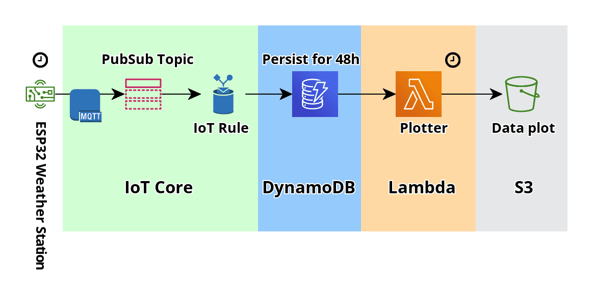

# IoT Weather Station

This is a small IoT project that collects temperature and humidity data and connects to AWS to store and process the data.

# Architecture

The IoT device is an *ESP32* with a connected *DHT11* sensor. The ESP32 connects to *AWS IoT Core* over wifi, takes a measurement every few minutes and sends it to AWS.

AWS IoT Core handles the messages and persists them in a *DynamoDB* table. An *AWS Lambda* function runs on a schedule to preprocess the data and generate plots, which are then stored in *S3*.

